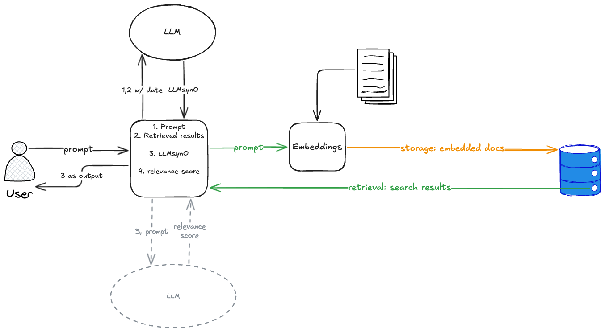

# MoreOn Chatbot

MoreOn Chatbot is a Streamlit-based conversational AI interface that integrates with an external Language Model API. It optionally enhances responses using Retrieval Augmented Generation (RAG) by indexing documents (PDFs and text files) with ChromaDB and SentenceTransformers.



## Installation

1. **Clone the Repository:**

   ```bash
   git clone <repository_url>
   cd <repository_directory>
   ```

2. **Set Up a Virtual Environment (Recommended):**

   ```bash
   python -m venv venv
   source venv/bin/activate   # On Windows: venv\Scripts\activate
   ```

3. **Install Dependencies:**

   ```bash
   pip install -r requirements.txt
   ```

## Configuration

The application is driven by a YAML configuration file located at `config/config.yaml`. Key settings include:

- **Paths:** Absolute/relative paths for:
  - `documents_folder`: Where PDF/txt documents are stored.
  - `links_file`: A file containing URLs to PDF documents.
  - `db_path`: The location of the persistent ChromaDB database.
- **LLM Settings:**
  - `llm.port`: Port where your LLM API is hosted (e.g., `5000`).
- **RAG Settings:**
  - `rag.enabled`: Boolean flag to enable/disable retrieval augmented generation.
  - `rag.rebuild_db`: Set to `True` to rebuild the document database on startup.

*Make sure to create and update `config/config.yaml` with the appropriate values for your environment.*

## Running the Chatbot

1. **Start the LLM API:**  
   Ensure that an LLM API is running locally. The API should listen on the port specified in your config (e.g., `http://localhost:5000/generate`) and accept POST requests with a JSON payload containing a `prompt` key.

2. **Launch the Chatbot Application:**

   Run the following command in the project root:

   ```bash
   streamlit run main.py
   ```

   This will open the Streamlit interface in your default browser.

3. **Using the Chat Interface:**
   - **Type your message** in the chat input.
   - If RAG is enabled, the chatbot will automatically retrieve context from relevant documents.
   - Click the **Clear Chat** button to reset the conversation history.

## Document Retrieval & RAG

If retrieval augmented generation is enabled:
- The application reads document URLs from the file specified in `config/config.yaml` (using the `links_file` setting).
- It downloads PDFs (or reads local text files), extracts text, and stores document embeddings in ChromaDB.
- When a query is made, the system retrieves the most relevant documents to include as context in the prompt.

## Logging & Debugging

- **Logging:** The application uses Python’s `logging` module to log informational, debugging, and error messages. Logs include status updates (e.g., config loading, document processing) and API communications.
- **Error Handling:** Common errors such as missing config files or API connectivity issues are logged and displayed.

## Contributing

Feel free to open issues or submit pull requests if you have improvements or bug fixes.

---
